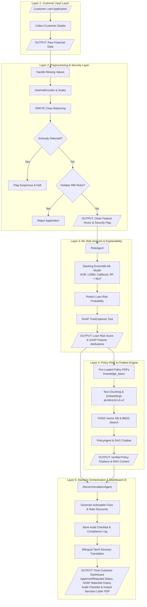

# 5-LAYER SYSTEM ARCHITECTURE DIAGRAM (LOAN-IQ)

This document provides the complete **5-Layer Architecture Specification**, including the newly added **Layer 5: Decision Orchestration, Audit Checklist & Interactive Web Dashboard**, along with an exact **Gemini Image Generation Prompt** and interactive **Mermaid Diagram**.

---

## 🎨 Gemini Image Generation Prompt (Use in Gemini / Midjourney)

Copy and paste the prompt below into Gemini or image generators to create the high-resolution 5-layer diagram visual:

```text
A crisp, professional 16:9 system architecture flowchart diagram on a royal blue background (#0000FF) with white box containers and black bold text. 5 horizontal layers arranged side by side:

1. "Layer 1: Customer Input Layer" - Contains Customer Loan Application, Collect Customer Details -> OUTPUT: Raw Financial Data.
2. "Layer 2: Preprocessing & Security Layer" - Contains Handle Missing Values, OneHotEncoder, SMOTE, Anomaly Detected?, Violates RBI Rules? -> OUTPUT: Clean Feature Vector & Security Flag.
3. "Layer 3: Machine Learning Risk Analysis & Explainability" - Contains RiskAgent, Meta-Learner Stacking Ensemble Model (XGBoost, LightGBM, CatBoost, RF + ANN Meta-Learner), Predict Loan Risk SHAP Explainer Tool -> OUTPUT: Loan Risk Score, SHAP Importance Report.
4. "Layer 4: Policy RAG & Chatbot Engine" - Contains PolicyAgent, Pre-loaded Bank Policy PDFs, Text Chunking & Embeddings (all-MiniLM-L6-v2), FAISS Vector Database, Interactive RAG Chatbot -> OUTPUT: Policy Citations & RAG Context.
5. "Layer 5: Decision Orchestration, Audit Checklist & Interactive Web Dashboard" - Contains RecommendationAgent, Generate Actionable Fixes & Interest Rate Discounts, Bank Audit Checklist & Compliance Log, Bilingual Tamil Glossary Translation -> OUTPUT: Final Customer Dashboard (Approved/Rejected Status, SHAP Reason Charts, Audit Checklist, Instant Sanction Letter PDF & Interactive UI).

Clean tech diagram, high contrast white cards, black arrows connecting layers, sharp readable typography.
```

---

## 📊 Complete 5-Layer System Architecture (Mermaid Flowchart)



---

## 🔍 Detailed Breakdown of Layer 5 (New Addition)

| Layer 5 Sub-Block | Component / Function | Purpose in Loan-IQ System |
| :--- | :--- | :--- |
| **RecommendationAgent** | MCP Agent 3 (`mcp_recommendation_tool`) | Evaluates output from Layer 3 (ML Score) & Layer 4 (Policy Rules) to construct final decision payload. |
| **Actionable Fix Generator** | Algorithmic Guidance Engine | Generates specific credit repair advice for rejected borrowers (e.g. reduce loan sum by 15%, extend tenure, add co-applicant). |
| **Bank Audit Checklist** | Policy Compliance Log | Generates an auditable pass/fail checklist for credit officers (CIBIL cutoff, FOIR cap, LTV margin, OVD KYC verification). |
| **Bilingual Tamil Glossary** | Tamil Translation Layer | Translates technical financial terms (CIBIL, FOIR, LTV, EMI, Moratorium, SMOTE) into clear Tamil explanations. |
| **Final Customer Dashboard** | Web UI / Streamlit / Dist PDF | Renders interactive dashboard tabs, SHAP waterfall charts, RAG policy chat, and downloadable Sanction Letter PDF. |
