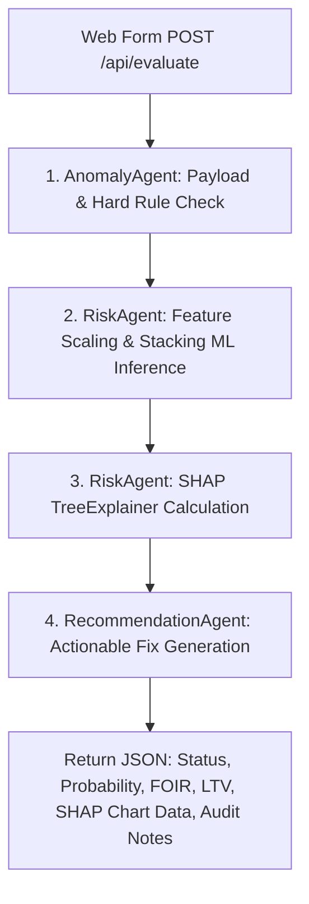
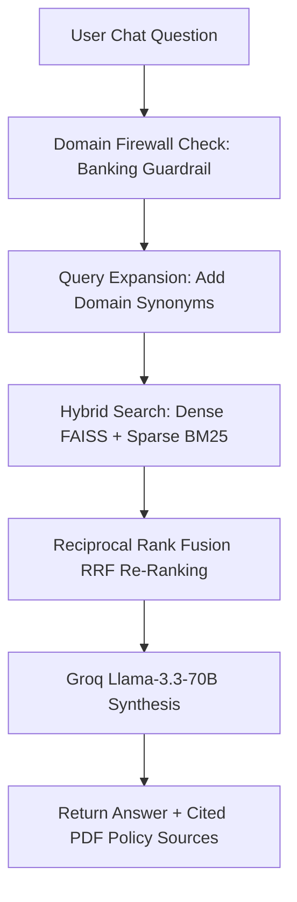

# APP.PY CODE STRUCTURE & ARCHITECTURE DEFENSE GUIDE (REVIEW 2)

This document provides a comprehensive, section-by-section breakdown of `app.py` for your **Review 2 Defense**.

---

## 🏛️ Executive Summary: What `app.py` Does

`app.py` is the central **Flask Web Server & AI Multi-Agent Orchestrator** for the **AI Loan Acceptance & Risk Analysis System (Loan-IQ)**.

It connects four major AI/ML engines:
1. **Stacking Ensemble Machine Learning Model** (XGBoost + LightGBM + CatBoost + Random Forest + ANN Meta-Learner).
2. **Explainable AI (XAI) SHAP Engine** (Calculates feature attributions for transparency).
3. **Hybrid RAG Policy Search Engine** (FAISS Vector DB + BM25 Sparse Search + Groq Llama-3.3-70B LLM).
4. **Model Context Protocol (MCP) Multi-Agent Framework** (Coordinates 4 dedicated agents for end-to-end automated credit underwriting).

---

## 📂 Section-by-Section Code Structure of `app.py`

```text
========================================================================================
                                 APP.PY CODE MAP
========================================================================================
 1. Environment & UTF-8 Setup       (Lines 1 - 26)   -> Imports, Flask & CORS init
 2. Groq LLM Client Init            (Lines 28 - 43)  -> Initializes Llama-3.3-70B API
 3. Model & Artifact Loader         (Lines 44 - 84)  -> Loads .pkl models & FAISS RAG index
 4. Hybrid Search Engine (RAG)      (Lines 85 - 161) -> Dense FAISS + Sparse BM25 + RRF
 5. Bank Hard Rule Engine           (Lines 163 - 217)-> Enforces SBI, HDFC, ICICI, IOB, Canara rules
 6. MCP Multi-Agent Orchestrator    (Lines 221 - 380)-> Defines 4 Dedicated MCP Agents
 7. REST API: /api/evaluate         (Lines 382 - 441)-> Loan Evaluation Endpoint
 8. REST API: /api/chat             (Lines 443 - 609)-> Policy RAG Chatbot Endpoint
 9. Fallback & Helper Functions     (Lines 610 - 869)-> Local synthesizer & static file server
========================================================================================
```

---

## 🤖 Detailed Breakdown of the 4 MCP Agents in `app.py`

### 1. `AnomalyAgent` (Agent 1 - Security & Hard Rule Validation)
* **Code Class**: `class AnomalyAgent` (`run_anomaly_check_tool`)
* **Role**: Validates payload sanity (age limits, negative income, out-of-bound CIBIL) and executes `apply_bank_hard_rules()`.
* **Output**: List of payload anomalies and hard policy violations (e.g. "FOIR 68% exceeds SBI cap of 65%").

### 2. `RiskAgent` (Agent 2 - ML Risk Scoring & SHAP Explainability)
* **Code Class**: `class RiskAgent` (`run_risk_scoring_tool` & `run_shap_explainer_tool`)
* **Role**: Passes applicant data through `StandardScaler` & `OneHotEncoder`, executes Stacking Classifier (`model.predict_proba`), and runs `shap.TreeExplainer` to calculate Shapley values.
* **Output**: Risk probability score (e.g. `94.2%`), calculated FOIR/LTV, and top 6 SHAP feature attributions.

### 3. `RecommendationAgent` (Agent 3 - Rationale & Fix Generator)
* **Code Class**: `class RecommendationAgent` (`run_recommendation_tool`)
* **Role**: Evaluates approval status and constructs actionable improvement steps for rejected applicants (e.g. "Reduce loan requested by 15%" or "Add salaried co-applicant").
* **Output**: Structurally formatted actionable recommendations.

### 4. `PolicyAgent` (Agent 4 - Hybrid RAG & Compliance Lookup)
* **Code Class**: `class PolicyAgent` (`run_policy_lookup_tool`)
* **Role**: Queries FAISS vector DB and BM25 index, applies Reciprocal Rank Fusion (RRF), and generates cited policy answers using Groq Llama-3.3-70B.
* **Output**: Policy citations and regulatory compliance verification text.

---

## 🔄 Execution Flow of the Main API Routes

### 🅰️ `/api/evaluate` (Loan Assessment Flow)


### 🅱️ `/api/chat` (Policy RAG Flow)


---

## 🎓 Expected Review 2 Defense Questions & Answers

### Q1: "How does your backend integrate Machine Learning with RAG?"
> **Answer**: `app.py` acts as a unified orchestrator. When an applicant submits data to `/api/evaluate`, the **RiskAgent** computes prediction probabilities using the Stacking ML model and SHAP. Simultaneously, when regulatory questions or audit notes are needed, the **PolicyAgent** uses FAISS RAG to query authentic bank policy PDFs.

### Q2: "Why use a Stacking Ensemble instead of a single model?"
> **Answer**: A single model like Decision Tree suffers from high variance. Our Stacking Ensemble combines **XGBoost, LightGBM, CatBoost, and Random Forest** as base learners, and uses an **ANN/MLP Meta-Learner** to combine their predictions. This achieves a superior **96.68% accuracy** and **0.9942 ROC-AUC**.

### Q3: "How do you handle class imbalance in credit datasets?"
> **Answer**: In real banking data, defaulted loans represent less than 5% of records. We applied **SMOTE (Synthetic Minority Over-sampling Technique)** during training in `scripts/train_model.py` to synthesize minority class samples, creating a balanced 50:50 dataset that eliminates approval bias.

### Q4: "What happens if the Groq LLM API is offline?"
> **Answer**: `app.py` contains a built-in local policy synthesizer function `_local_policy_synthesize()`. If the Groq API times out or is offline, `app.py` automatically falls back to local regex and RRF extraction without breaking the application.
