# REVIEW 2 ARCHITECTURE & INTEGRATION GUIDE

This document provides a complete, end-to-end technical explanation of how the **React Frontend**, **Python Flask Backend**, **ML/SHAP Models**, **FAISS RAG Engine**, and **Groq Cloud LLM API** connect and communicate for your **Review 2 Defense**.

---

## 🏛️ End-to-End System Integration Flow Diagram

```mermaid
sequenceDiagram
    autonumber
    actor User as Borrower / Underwriter
    participant React as React Frontend (Vite)
    participant API as Services Layer (api.js)
    participant Flask as Flask Backend (app.py)
    participant ML as ML & SHAP Models (models/*.pkl)
    participant RAG as FAISS + BM25 RAG Index (rag_index/)
    participant Groq as Groq Cloud API (Llama-3.3-70B)

    %% Flow 1: Application Evaluation
    rect rgb(30, 41, 59)
    note right of User: 1. Loan Application Evaluation Flow
    User->>React: Fills Loan Form & Clicks "Evaluate Application"
    React->>API: Calls evaluateLoan(formData)
    API->>Flask: HTTP POST /api/evaluate (JSON Payload)
    Flask->>Flask: Agent 1 (AnomalyAgent): Check Sanity & Hard Rules
    Flask->>ML: Agent 2 (RiskAgent): StandardScaler + XGBoost Stacking Inference
    ML-->>Flask: Risk Score (e.g. 94.2% Probability)
    Flask->>ML: Agent 2 (RiskAgent): Calculate SHAP TreeExplainer Values
    ML-->>Flask: Top Feature Attributions (CIBIL +38.2%, FOIR -12.1%)
    Flask->>Flask: Agent 3 (RecommendationAgent): Generate Actionable Fixes & Audit Log
    Flask-->>API: Returns JSON (approved, probability, foir, ltv, shap, recommendations)
    API-->>React: Updates Component State
    React-->>User: Displays Status Badge, Chart.js SHAP Waterfall Chart & Sanction PDF
    end

    %% Flow 2: Policy Chatbot
    rect rgb(15, 23, 42)
    note right of User: 2. Policy RAG Chatbot Flow
    User->>React: Types Policy Question ("What is SBI Home Loan minimum income?")
    React->>API: Calls sendChatMessage(prompt, context)
    API->>Flask: HTTP POST /api/chat (JSON Payload)
    Flask->>Flask: Agent 4 (PolicyAgent): Domain Guardrail Firewall Check
    Flask->>RAG: Hybrid Search: Dense FAISS + Sparse BM25 + RRF Re-Ranking
    RAG-->>Flask: Top 4 Cited Policy PDF Chunks
    Flask->>Groq: Query Groq LLM (Llama-3.3-70B) with RAG Context Prompt via API Key
    Groq-->>Flask: Generated Policy Answer
    Flask-->>API: Returns JSON (answer, cited_sources)
    API-->>React: Updates Chat Component State
    React-->>User: Renders Markdown Answer + Interactive Citation Cards
    end
```



---

## 🔗 Component Connection Breakdown

### 1️⃣ React Frontend to Python Flask Backend (`src/services/api.js` <-> `app.py`)
* **Transport Protocol**: Asynchronous HTTP/HTTPS REST API requests using native browser `fetch()` API.
* **CORS Handling**: Enabled in Flask via `flask_cors.CORS(app)` to allow cross-origin requests between React (port `5173`) and Flask (port `5000`).
* **Endpoints**:
  * `POST /api/evaluate`: Transmits applicant financial variables to trigger ML prediction and SHAP calculations.
  * `POST /api/chat`: Transmits user prompts to trigger hybrid FAISS search and Groq LLM synthesis.

---

### 2️⃣ Flask Backend to Machine Learning & SHAP Models (`app.py` <-> `models/*.pkl`)
* **Model Serialization**: Models are saved as binary `.pkl` files using Python `pickle` during offline training (`scripts/train_model.py`).
* **At Startup**: `app.py` loads `loan_model.pkl` (Stacking Ensemble Classifier), `preprocessor.pkl` (`StandardScaler` + `OneHotEncoder`), and `threshold.pkl` into RAM.
* **Inference Pipeline**:
  1. `preprocessor.transform(df_in)` scales continuous features and One-Hot encodes categorical attributes.
  2. `model.predict_proba(df_processed)` computes probability of loan approval.
  3. `explainer = shap.TreeExplainer(model)` calculates exact Shapley values for each attribute.
  4. Attributions are formatted into arrays (`labels` and `values`) and returned to React to render the Chart.js SHAP waterfall chart.

---

### 3️⃣ Flask Backend to Groq Cloud LLM API (`app.py` <-> Groq API Cloud)
* **Environment Configuration**: `app.py` loads `GROQ_API_KEY` from `.env` using `python-dotenv`.
* **Client Initialization**:
  ```python
  from openai import OpenAI

  client = OpenAI(
      base_url="https://api.groq.com/openai/v1",
      api_key=os.getenv("GROQ_API_KEY"),
      timeout=8.0
  )
  ```
* **Execution Flow**:
  1. **Hybrid RAG Search**: Agent 4 (`PolicyAgent`) queries `rag_index/faiss_index` (Dense vector search) and `rag_index/bm25_index.pkl` (Sparse keyword search), applying Reciprocal Rank Fusion (RRF) to retrieve the top 4 policy PDF chunks.
  2. **Prompt Synthesis**: `app.py` constructs a System Prompt injecting the retrieved PDF policy chunks and applicant context.
  3. **Groq Cloud Completion**: Calls `client.chat.completions.create(model="llama3-70b-8192", ...)` via secure HTTPS. Groq's LPU hardware returns the synthesized completion in ~400ms.
  4. **Fallback Mechanism**: If the Groq API key is missing or offline, `app.py` automatically falls back to `_local_policy_synthesize()` without breaking the app.

---

## 🎓 Expected Review 2 Questions on Integration

### Q1: "How does data flow from the user interface to the machine learning model?"
> **Answer**: When a user clicks 'Evaluate Application' in React (`ApplicationFormTab.jsx`), `api.js` sends an HTTP POST request to Flask (`/api/evaluate`). Flask passes the JSON data to **RiskAgent** in `app.py`, which transforms the features using `preprocessor.pkl`, computes prediction probabilities using `loan_model.pkl`, calculates feature importance using SHAP, and returns the structured JSON response back to React.

### Q2: "How is the Groq API Key kept secure?"
> **Answer**: The Groq API key is stored on the server side inside an environment file (`.env`). The React frontend never sees or handles the API key. All LLM calls originate securely from the Python Flask backend server (`app.py`).

### Q3: "What happens if a user asks a question unrelated to banking?"
> **Answer**: `app.py` implements a strict Python Domain Firewall (`is_banking_related`). If a user prompt contains off-topic keywords (e.g. sports, politics), `app.py` intercepts the query before calling Groq or FAISS and returns a polite domain restriction notice.
